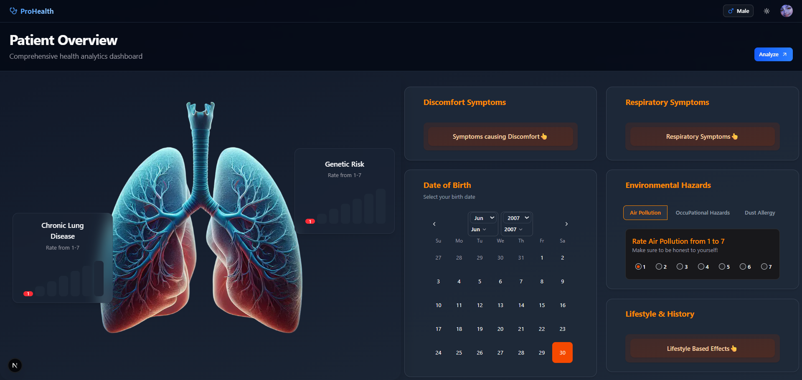
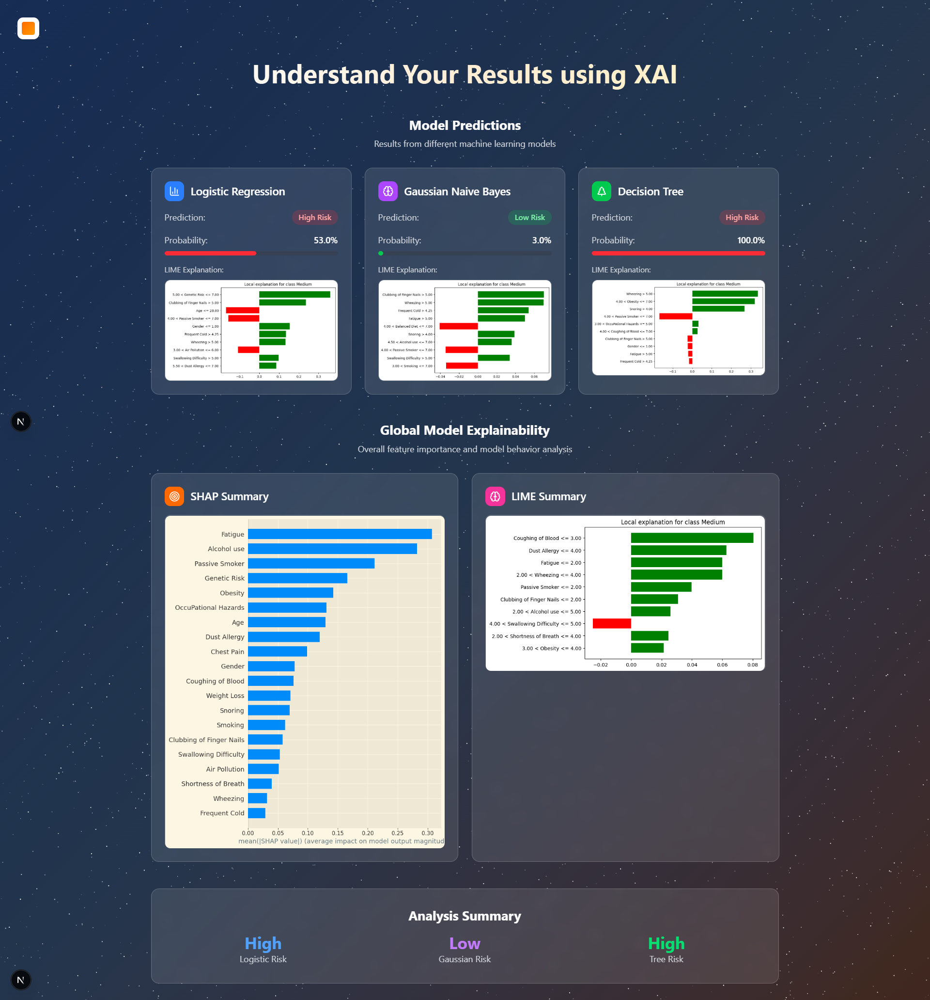
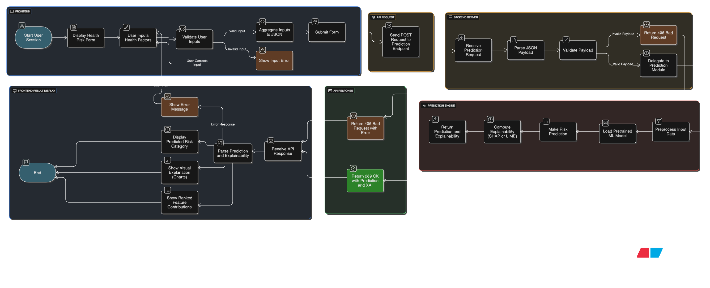

# Lung Cancer Explainable AI

## Project Overview

This project predicts lung cancer risk using machine learning and provides explainable AI (XAI) visualizations. It consists of a Django REST API backend for model inference and a Next.js/React frontend for user interaction and visualization.


---

## Table of Contents
- [Project Overview](#project-overview)
- [Directory Structure](#directory-structure)
- [Prerequisites](#prerequisites)
- [Backend Setup (Django)](#backend-setup-django)
- [Frontend Setup (Next.js)](#frontend-setup-nextjs)
- [Connecting Frontend and Backend](#connecting-frontend-and-backend)
- [Troubleshooting](#troubleshooting)

---


## Directory Structure

```
lung_cancer_explainable_ai/
  backend/           # Django backend (API, models, ML, etc.)
    api/             # Django app for API endpoints
    backend/         # Django project settings
    data/            # Data files (e.g., CSV)
    model_images/    # Model explanation images
    model_paths/     # Saved ML models (.joblib)
    manage.py        # Django management script
    requirements.txt # Python dependencies
  frontend/          # Next.js frontend
    src/             # React source code
    public/          # Static assets
    package.json     # Node dependencies
  README.md          # Project documentation
```

---

## Prerequisites

- **Python 3.9+** (for backend)
- **Node.js 18+** and **npm** (for frontend)

---
## REST API Working
For information on model training and our working only on ML part refer - [`testing/AIML_EL.ipynb`](testing/AIML_EL.ipynb)

---
## Backend Setup (Django)

1. **Navigate to the backend directory:**
   ```bash
   cd backend
   ```

2. **Create a virtual environment (recommended):**
   ```bash
   python -m venv venv
   # On Windows:
   venv\Scripts\activate
   # On macOS/Linux:
   source venv/bin/activate
   ```

3. **Install dependencies:**
   ```bash
   pip install -r requirements.txt
   ```

4. **Apply database migrations:**
   ```bash
   python manage.py migrate
   ```

5. **Run the backend server:**
   ```bash
   python manage.py runserver
   ```
   The API will be available at [http://localhost:8000](http://localhost:8000)

6. **Notes:**
   - The backend uses Django REST Framework, CORS headers, and loads ML models from `model_paths/`.
   - Ensure the `model_paths/` and `model_images/` directories exist and contain the required files.
   - The default database is SQLite (`db.sqlite3`).
   - Ensure the paths are correct in `backend/api/predictor.py`
   - Default values in `predictor.py` are :` MODEL_PATHS = settings.BASE_DIR / "model_paths"`,`MODEL_IMAGES = settings.MEDIA_ROOT`,`DATASET_PATH = settings.BASE_DIR / "data" / "cancer_patient.csv"`

---

## Frontend Setup (Next.js)

1. **Navigate to the frontend directory:**
   ```bash
   cd frontend
   ```

2. **Install dependencies:**
   ```bash
   npm install
   # or
   yarn install
   ```

3. **Run the development server:**
   ```bash
   npm run dev
   # or
   yarn dev
   ```
   The frontend will be available at [http://localhost:3000](http://localhost:3000)

4. **Build and start (for production):**
   ```bash
   npm run build
   npm start
   ```
5. **Notes**
   - Every step involving some download is written in `my_steps_for_frontend.txt`
   - Follow exactly tailwind documentation with next js for enabling tailwid css if building from scratch
   - https://tailwindcss.com/docs/installation/framework-guides/nextjs

---

## Connecting Frontend and Backend

- The frontend expects the backend API to be running at `http://localhost:8000`.
- CORS is enabled for `http://localhost:3000` in the backend settings.
- If you change ports or deploy, update the allowed origins in `backend/backend/settings.py`.

---

## Troubleshooting

- **Backend:**
  - If you get `ModuleNotFoundError`, ensure your virtual environment is activated and dependencies are installed.
  - If migrations fail, check your database file permissions or delete `db.sqlite3` and re-run migrations (data will be lost).
  - For CORS issues, verify the `CORS_ALLOWED_ORIGINS` in Django settings.

- **Frontend:**
  - If you get dependency errors, delete `node_modules` and `package-lock.json`/`yarn.lock`, then reinstall.
  - For API errors, ensure the backend is running and accessible from the frontend.

---

## Additional Notes

- ML models are stored in `backend/model_paths/` and loaded by the backend API.
- Model explanation images are in `backend/model_images/`.
- Data files are in `backend/data/`.
- For development, you can use the provided Jupyter notebook and scripts in `testing/` for experiments.
- Once again to set up frontend from scratch follow `my_steps_for_frontend.txt`

---

## License

This project is for educational and research purposes.

---
## 📞 Contact
- [Vaibhav SP](https://github.com/vaibhavsp) 
- [SriRam.A](https://github.com/Sri-Ram-A) 
